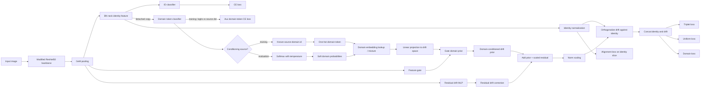

# Manifold-Aware Person Re-Identification

This repository is an asymmetric fork of [BAU (Balancing Alignment and Uniformity)](https://github.com/yoonkicho/BAU) for domain-generalizable person re-identification. Relative to the original BAU codebase, it adds an explicit **direction-aware retrieval geometry**, **AG-ReIDv2 cross-view protocol support**, and a broader set of training/evaluation controls for studying when asymmetric matching helps.

The motivating assumption is that probe-to-gallery retrieval is not always symmetric in multi-camera deployments. Matching an aerial probe against a ground gallery can be systematically different from the reverse direction. This fork therefore extends BAU with a **Randers/Finsler-style asymmetric distance** while keeping the backbone feature extractor in Euclidean space.

The README below focuses on what is actually implemented in the current codebase, what differs from old BAU, and which of those differences are plausible contributors to improved metrics.

---

## What Changed Relative to the Original BAU Repository?

| Area | Original BAU | This fork |
|------|--------------|-----------|
| Retrieval geometry | Symmetric Euclidean / manifold-aware ranking | Adds asymmetric Randers/Finsler ranking via `resnet50_finsler` and `finsler_drift_dist` |
| Backbone output | Single embedding | Structured embedding `[identity | drift]` for Finsler runs |
| Distance learning | Fixed Euclidean triplet/eval path | Pluggable `dist_func`, learnable `alpha`, multiple drift integration methods |
| Dataset support | Standard BAU DG datasets | Adds AG-ReIDv2, view-filtered source domains, and cross-view protocol files |
| Training controls | Compact BAU recipe | Adds drift-specific LR, drift alignment toggle, omega regularization, memory-bank mode, bidirectional triplet, fine-tuning hooks |
| Evaluation controls | Standard BAU evaluator | Evaluation can rank on identity-only or full `[identity|drift]` embeddings |

These are implementation-level differences from [old_bau/BAU](old_bau/BAU), not just documentation changes.

---

## Fork-Specific Contributions

### 1. Asymmetric Finsler Backbone: `resnet50_finsler`

The main architectural addition is a split-head ResNet-50 that returns:

```text
embedding = [identity (2048-d) | drift (N-d)]
```

- **Identity branch**: the standard BN-neck feature used for ID classification.
- **Drift branch**: `FinslerDriftHead`, a learnable vector field intended to encode directional bias induced by viewpoint/domain shift.
- **Orthogonalization step**: the drift vector is projected to be orthogonal to the normalized identity branch before concatenation.
- **Evaluation selector**: `select_eval_embedding()` can rank with either the full embedding or the identity slice alone.

Implemented in:

- `bau/models/model.py` (`FinslerDriftHead`, `resnet50_finsler`)
- `bau/models/__init__.py` (new `resnet50_finsler` registry entry)

Why this may help metrics:

- It gives the model a dedicated channel for camera/viewpoint asymmetry instead of forcing all variation into a symmetric identity embedding.
- It separates identity discrimination from directional retrieval bias, which is especially relevant for aerial-to-ground protocols.

### 2. Asymmetric Distance Layer: `finsler_drift_dist()`

The old BAU code optimizes and evaluates with symmetric distances. This fork adds a dedicated asymmetric distance on concatenated `[identity|drift]` features:

$$
d_F(x, y) = d_E(x_{id}, y_{id}) + \text{asymmetry}(x_{drift}, y_{drift}, x_{id}, y_{id})
$$

The exact asymmetry term is configurable via:

- `constant_drift`
- `symmetric_trapezoidal`
- `slerp`
- `analytical`

Implemented in:

- `bau/loss/triplet.py` (`finsler_drift_dist`)

Important current behavior:

- The evaluator can use the configured drift method.
- `TripletLoss` deliberately forces `symmetric_trapezoidal` when training with the Finsler distance for stability.

Why this may help metrics:

- Hard mining and final ranking are no longer restricted to symmetric similarity.
- The model can score the same pair differently depending on query direction, which is a plausible advantage in cross-view ReID.

### 3. Learnable Randers Weight: `AlphaParameter`

This fork adds a bounded, learnable global scalar `alpha` that interpolates between a Euclidean baseline and the asymmetric distance:

$$
\alpha \in [0, \alpha_{max}], \qquad \alpha = 2\alpha_{max}\left|\sigma\left(\frac{r}{T}\right)-0.5\right|
$$

Properties of the current implementation:

- initialized at `alpha = 0` when `--alpha-init 0.0` is used,
- bounded by `--alpha-max`,
- temperature-controlled by `--alpha-temp`,
- logged to W&B each epoch,
- saved/restored through `alpha_state` in training checkpoints.

Implemented in:

- `bau/loss/triplet.py` (`AlphaParameter`)
- `examples/train_bau.py` (construction, logging, checkpoint restore)

Why this may help metrics:

- Training can begin from the original Euclidean regime and only increase asymmetry if the data supports it.
- This reduces the risk of committing too early to a strongly asymmetric scoring function.

### 4. Geometry-Aware BAU Training Pipeline

This fork does more than add a new distance function; it threads the geometry through the trainer, evaluator, and memory bank.

#### Training-side additions

- `BAUTrainer` reads `model.dist_func` instead of assuming Euclidean ranking.
- `TripletLoss` accepts pluggable distance functions and optional `alpha`.
- Alignment on Finsler models is performed on the **identity slice only** by default.
- Optional drift-only alignment can be enabled with `--use-drift-align`.
- Drift-head gradients are clipped with `max_norm = 1.0`.
- Drift-head parameters use a reduced learning rate via `--drift-lr-mult`.
- Optional omega regularization is exposed through `--use-omega-reg` and `--omega-reg-weight`.

#### Memory-bank additions

- `MemoryBank` can store either full `[identity|drift]` features or identity-only features.
- In full Finsler mode, the identity slice is normalized separately from the drift slice (`--memory-bank-mode full`).

#### Evaluation additions

- Ranking uses the model’s active `dist_func`.
- `--eval-drift true/false` switches between full asymmetric ranking and identity-only ranking.

Implemented across:

- `bau/trainers.py`
- `bau/evaluators.py`
- `bau/models/memory.py`
- `examples/train_bau.py`

Why this may help metrics:

- The retrieval geometry used for triplet mining, repulsion losses, memory-bank updates, and evaluation is more aligned than in a purely Euclidean pipeline.
- Reduced drift-head LR and gradient clipping can make asymmetric training more stable.

### 5. AG-ReIDv2 as Multi-Source, Cross-View DG Benchmark

Old BAU did not include AG-ReIDv2. This fork adds:

- full AG-ReIDv2 dataset support,
- view-filtered source-domain splits,
- query/gallery loading from official cross-view protocol files,
- PID relabeling after camera filtering.

Supported dataset keys:

| Key | Meaning |
|-----|---------|
| `agreidv2` | full AG-ReIDv2 dataset |
| `agreidv2_aerial` | C0-only training source |
| `agreidv2_wearable` | C2-only training source |
| `agreidv2_cctv` | C3-only training source |
| `agreidv2_ground` | C2+C3 training source |
| `agreidv2_aerial_to_cctv` | aerial query, CCTV gallery |
| `agreidv2_aerial_to_wearable` | aerial query, wearable gallery |
| `agreidv2_cctv_to_aerial` | CCTV query, aerial gallery |
| `agreidv2_wearable_to_aerial` | wearable query, aerial gallery |

Implemented in:

- `bau/datasets/agreidv2.py`
- `bau/datasets/__init__.py`

Why this may help metrics:

- BAU’s domain loss operates on cleaner, semantically meaningful source domains when viewpoints are split instead of merged.
- The benchmark now directly matches the asymmetric retrieval setting that motivates the Finsler extension.

### 6. Expanded Experimental Surface for Ablations

Compared with the original BAU parser, this fork exposes a much larger set of switches for attribution and ablation:

- `--drift-method`
- `--drift-dim`
- `--memory-bank-mode`
- `--eval-drift`
- `--bidirectional-triplet`
- `--use-drift-align`
- `--use-omega-reg`
- `--fine-tuning`
- `--checkpoint-path`
- `--alpha`, `--alpha-init`, `--alpha-max`, `--alpha-temp`
- standard BAU loss toggles (`--no-align`, `--no-uniform`, `--no-domain`, `--no-triplet`, `--no-ce`, `--use-aug-ce`)

This makes it possible to isolate whether gains come from the asymmetric geometry itself, the dataset protocol, or stabilization choices in the training recipe.

---

## Which Differences Are Most Likely to Matter for Metrics?

The repository contains multiple simultaneous changes, so the codebase does **not** prove that any single factor caused the observed improvements. Conservatively, the strongest plausible contributors are:

1. **Asymmetric ranking itself** via `resnet50_finsler` + `finsler_drift_dist`.
2. **AG-ReIDv2 protocol restructuring** into view-specific source domains and explicit cross-view target splits.
3. **Train/eval geometry alignment** through shared `dist_func` hooks in the trainer and evaluator.
4. **Stability controls** such as reduced drift-head LR, gradient clipping, and optional omega regularization.
5. **Learnable `alpha`**, which lets the model interpolate between the original Euclidean baseline and the asymmetric regime.

In other words, this fork changes both the **representation** and the **experimental protocol** relative to old BAU. Either can affect mAP/Rank-1.

---

## Current Implementation Notes and Caveats

This section documents current behavior that matters for reproduction.

### Gradient-flow caveat

Earlier design notes in this repository describe identity-detached uniform/domain repulsion for Finsler training. In the **current active trainer code**, identity-only alignment is implemented, but the detached-identity path for uniform/domain losses is commented out. The current README therefore treats those losses as geometry-aware, not fully gradient-isolated.

### Default values that matter

- `--drift-lr-mult` currently defaults to `0.05` in code.
- The ViT architecture key is `vitbase`, not `vit_base_patch16`.
- `resnet50_finsler` explicitly disables manifold mode and forces Euclidean-space Finsler distance.

### Standalone evaluation caveat

Training saves wrapped checkpoints of the form:

```text
{
  'state_dict': ...,
  'alpha_state': ...   # optional
}
```

The current `examples/test.py` script loads the checkpoint directly into `copy_state_dict()` without unwrapping `state_dict`. Final in-training evaluation handles this correctly, but standalone testing may require a small loader fix or a checkpoint that has already been unpacked.

---

## Supported Architectures

| `--arch` | Geometry | Notes |
|----------|----------|-------|
| `resnet50` | Euclidean by default, optional manifold-aware mode | closest to original BAU baseline |
| `resnet50_finsler` | asymmetric Randers/Finsler | split identity + drift embedding |
| `mobilenetv2` | Euclidean by default, optional manifold-aware mode | lightweight baseline |
| `vitbase` | Euclidean by default, optional manifold-aware mode | ViT backbone key used by the current code |

---

## Setup

```bash
pip install -r requirements.txt
pip install -e .
```

---

## Training Examples

### Original-style Euclidean BAU baseline

```bash
python examples/train_bau.py \
    --arch resnet50 \
    -ds market1501 msmt17 cuhksysu \
    -dt cuhk03 \
    --logs-dir logs/baseline
```

### Finsler training on view-filtered AG-ReIDv2 sources

```bash
python examples/train_bau.py \
    --arch resnet50_finsler \
    -ds agreidv2_aerial agreidv2_cctv agreidv2_wearable \
    -dt agreidv2_aerial_to_cctv \
    --drift-lr-mult 0.05 \
    --memory-bank-mode full \
    --eval-drift true \
    --logs-dir logs/finsler_agreidv2
```

### Finsler training with learnable alpha

```bash
python examples/train_bau.py \
    --arch resnet50_finsler \
    -ds agreidv2_aerial agreidv2_cctv agreidv2_wearable \
    -dt agreidv2_aerial_to_cctv \
    --alpha-init 0.0 \
    --alpha-max 1.0 \
    --alpha-temp 1.0 \
    --logs-dir logs/finsler_alpha
```

### Useful fork-specific flags

| Flag | Default | Meaning |
|------|---------|---------|
| `--drift-method` | `symmetric_trapezoidal` | asymmetry integration rule used by evaluator / non-triplet losses |
| `--drift-dim` | `2048` | drift branch dimensionality |
| `--eval-drift` | `true` | use full `[identity|drift]` embedding at evaluation |
| `--memory-bank-mode` | `full` | memory bank stores `full` or `identity` embeddings |
| `--drift-lr-mult` | `0.05` | reduced LR for the drift head |
| `--use-drift-align` | `false` | enable drift-branch alignment loss |
| `--use-omega-reg` | `false` | add explicit drift norm regularization |
| `--alpha-init` | `None` | enable learnable alpha when set |
| `--bidirectional-triplet` | `false` | add inverse-direction batch-hard triplet loss |

---

## Evaluation

The current standalone evaluator expects `-d/--dataset`, not `-t`.

```bash
python examples/test.py \
    --arch resnet50_finsler \
    --resume path/to/checkpoint.pth \
    -d agreidv2_aerial_to_cctv
```

Primary reported metrics remain **mAP** and **CMC / Rank-k** on unseen target domains.

---

## Repository Layout

```text
bau/
├── models/
│   ├── model.py              # resnet50, resnet50_finsler, mobilenetv2, vitbase
│   └── memory.py             # Finsler-aware memory bank behavior
├── loss/
│   ├── triplet.py            # euclidean_dist, finsler_drift_dist, AlphaParameter
│   └── crossentropy.py
├── datasets/
│   ├── __init__.py           # dataset registry including AG-ReIDv2 variants
│   └── agreidv2.py           # view-filtered and protocol-driven AG-ReIDv2 loader
├── trainers.py               # geometry-aware BAU training loop
└── evaluators.py             # pluggable ranking distance and eval embedding selector
examples/
├── train_bau.py              # main training entry point and CLI
└── test.py                   # standalone evaluation entry point
results/                      # result tables and ablation summaries
sbatch/                       # cluster recipes for sweeps and ablations
scripts/                      # helper scripts for training/evaluation/result parsing
changelogs/
├── learnableAlpha.md
└── learnableOmega.md
```

---

## Summary

This repository should be read as **BAU + asymmetric geometry + AG-ReIDv2 cross-view protocol engineering**, not as a minimal patch to the original codebase. The observed improvements, where present, can reasonably come from any combination of:

- the new asymmetric distance,
- the split identity/drift representation,
- the AG-ReIDv2 protocol design,
- the geometry-aware trainer/evaluator integration,
- and the stabilization choices added for the drift branch.

That is the core distinction this fork adds over the original BAU implementation.

---

## Research Status Update — 2026-03-11

Current results suggest that the original **per-instance drift** formulation is not yet strong enough to support a broad claim that explicit Finsler asymmetry consistently improves domain-generalizable person ReID. In particular, the observed gains over the Euclidean BAU baseline remain small, and the learned drift magnitude often stays close to zero. A conservative interpretation is that BAU-style DG training partially suppresses instance-level asymmetry because the training objective strongly favors identity invariance.

The current research effort is therefore pivoting toward a more structured hypothesis:

> **Asymmetry should be modeled primarily at the domain/view level, not at the identity level.**

This pivot is motivated by the AG-ReIDv2 setting already supported in the repository. In cross-view aerial/ground retrieval, the dominant directional bias is more plausibly tied to **camera/view geometry** than to a specific person identity. The next implementation stage therefore keeps the identity pathway stable while reworking the drift branch into a **domain-conditioned nuisance component**.

### Current pivot hypothesis

1. **When asymmetry helps:** primarily in structured cross-view or cross-domain settings where query and gallery observations are not information-symmetric.
2. **What level it should live at:** domain/view-level latent structure, optionally with a small per-instance residual.
3. **Why DG collapses it:** alignment and uniformity objectives penalize domain-specific variation, so an unconstrained instance drift tends to shrink toward a near-Euclidean regime.

### Active implementation direction

The current codebase is being extended to support a modular **domain-conditioned Finsler drift** path that:

- preserves the existing identity branch,
- reuses source-domain labels already available in multi-source BAU training,
- supports a soft domain/view-token predictor at inference time,
- keeps the original instance-conditioned drift path available for comparison,
- and remains backward-compatible with existing `resnet50_finsler` experiments where possible.

### Lowest-risk way to test the pivot

The safest validation path is:

1. start with **AG-ReIDv2 source-domain conditioning** using the already available view-filtered source datasets,
2. keep the original BAU optimization recipe as unchanged as possible,
3. modify only the drift-generation mechanism in the first pass,
4. compare against both the Euclidean BAU baseline and the current instance-drift Finsler baseline,
5. report both **identity-only** and **drift-enabled** evaluation,
6. add diagnostics showing whether domain-conditioned drift meaningfully changes ranking behavior.

This makes the next phase of the project less risky: even if the new drift formulation does not improve mAP materially, it can still clarify whether asymmetry is a useful **structured nuisance factor** rather than a direct accuracy booster.

### Domain-conditioned drift head: architecture and evaluation prior

The new `DomainConditionedDriftHead` is meant to answer a very specific question:

> instead of predicting a completely free drift vector per sample, can the model build drift from a **shared domain/view prior** plus a small residual correction?

The easiest way to read the current implementation is to split it into four parts:

1. **Identity path**
    - the image goes through the ResNet backbone, GeM pooling, and BN neck exactly as before,
    - this produces the identity feature used for ID classification and the identity slice of the final embedding.

2. **Domain-token predictor**
    - when `--drift-conditioning domain` is active, a small linear classifier reads the BN-neck identity feature,
    - during training, the trainer already knows the source-domain label `did`, so the model can use that label directly for conditioning,
    - in parallel, an auxiliary cross-entropy loss can train the predictor to recover the source domain from the identity feature.

3. **Domain-conditioned drift prior**
    - each source domain has a learnable domain embedding,
    - the selected or inferred domain token is mapped into drift space,
    - a feature-dependent gate modulates how much of that domain prior should be expressed for the current image.

4. **Residual correction and final drift**
    - a small residual MLP still produces a per-instance correction,
    - the final drift is:

$$
\omega(x) = \omega_{domain}(x) + \lambda\,\omega_{residual}(x)
$$

where $\lambda$ is `domain_residual_scale`,
- the drift is then norm-scaled and orthogonalized against the normalized identity feature before concatenation.

#### What happens on unseen instances at evaluation?

At evaluation time there is usually **no ground-truth domain label** available for the target image. The current design therefore uses a **soft prior**:

1. compute the BN-neck identity feature,
2. feed a **detached** copy of it into the domain classifier,
3. obtain domain logits over the training source domains,
4. convert logits into a soft probability vector with temperature scaling,
5. use that probability vector to form a weighted combination of the learned domain embeddings,
6. map that combined domain context into drift space,
7. add the residual correction and continue as usual.

So the model does **not** assume that the test image belongs exactly to one known source domain. Instead, it predicts a **soft mixture over source-domain priors** and uses that mixture as the conditioning signal for the drift branch.

The `detach()` in `_predict_domain_logits()` is intentional: the domain-token predictor is trained to **read** identity features, but it does not directly push gradients back into the identity backbone through this auxiliary path.

#### Mermaid flow chart



#### Loss connections in the current implementation

- **CE loss**: applied to the identity classifier output.
- **Triplet loss**: applied to the combined embedding path already used by `resnet50_finsler`.
- **Alignment loss**: still applied on the identity slice by default.
- **Uniform loss / domain loss**: use the current Finsler embedding path as in the trainer.
- **Auxiliary domain-token CE loss**: only active when the domain-conditioned path returns domain logits and `--domain-token-loss-weight > 0`.

This means the new head is **not** a separate second model. It is a drop-in replacement for the old drift head inside `resnet50_finsler`, with one additional auxiliary loss that teaches the model how to infer a soft domain prior at test time.
