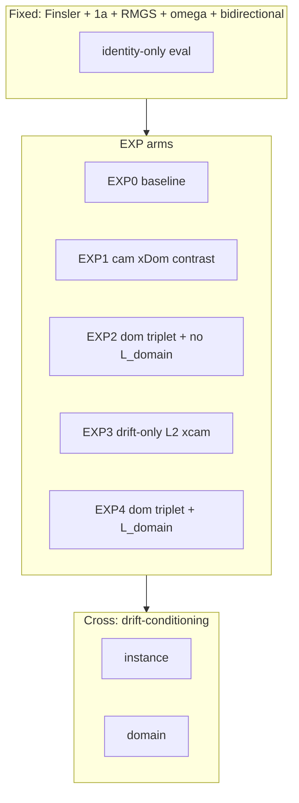
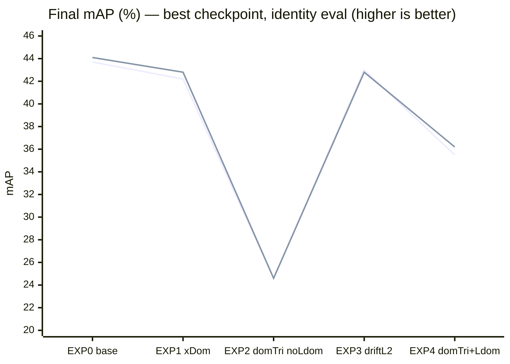

# Loss ablation sweep (Idea‑1 extensions): analysis and conclusions

**Job ID:** `1512947` (SLURM array `0–9`)  
**Script:** `sbatch/sweep_loss_ablation_Idea1_extensions.sbatch`  
**Log root:** `logs/sweep_loss_ablation_Idea1/job_1512947_*`  
**Analysis date:** 2026-03-23  

This document synthesizes the **aim**, **design**, **quantitative outcomes**, and **next steps** for the sweep referenced in `changelogs/supervisor_meeting_20_03.md` and `changelog.md` (entries 2026-03-21).

---

## 1. Aim and premise (what the sweep was meant to test)

### 1.1 Research narrative (repository alignment)

Per `README.md`, the fork studies **asymmetric Randers/Finsler retrieval** with a split **identity | drift** embedding, while the active pivot is toward **domain-/view-level** structure rather than unconstrained instance drift. The supervisor meeting (`changelogs/supervisor_meeting_20_03.md`) formalized **Idea 1**: separate **identity metric learning** (Euclidean on the identity slice) from **geometry-aware auxiliary terms** that act on the full Finsler embedding or on drift.

### 1.2 Fixed recipe (shared across all ten runs)

| Setting | Value |
|--------|--------|
| Architecture | `resnet50_finsler` |
| Source → target | Market1501 + MSMT17 + CUHK-SYSU → **CUHK03** |
| Sampler | `RandomMultipleGallery` (cross-camera positives) |
| Identity triplet | **`--identity-triplet-only`** (Euclidean on identity slice; 1a) |
| Bidirectional triplet | on |
| Omega regularization | `--use-omega-reg --omega-reg-weight 1.5` |
| Eval | **`--eval-drift false`** → ranking uses **identity slice** (drift not used at test) |
| Drift integration (training / non-triplet) | `symmetric_trapezoidal` |
| Epochs | 60; best checkpoint reloaded for final eval |

**Factor crossed:** `COND ∈ {instance, domain}` via `--drift-conditioning` → run names `driftInst` / `driftDom` (domain-conditioned drift head + auxiliary domain-token path when `domain`).

### 1.3 Loss arms (`EXP = floor(TASK_ID/2)`)

| EXP | Arm | Extra flags (conceptual) |
|-----|-----|---------------------------|
| 0 | **Baseline** | 1a only |
| 1 | **Refined 1b (camera)** | `--use-cross-domain-contrastive --cross-domain-contrastive-nuisance camera --cross-domain-contrastive-weight 0.1` |
| 2 | **Domain triplet, no `L_domain`** | `--no-domain --use-domain-triplet` (camera mining, weight 1.0) |
| 3 | **Drift-only cross-camera L2** | `--use-drift-only-cross-contrastive --drift-only-cross-contrastive-weight 0.1` |
| 4 | **Domain triplet + `L_domain`** | `--use-domain-triplet` (camera mining), **without** `--no-domain` |

**Premise under test:** (i) refined 1b should pull **same-ID, different-camera** pairs together under \(d_F\) without contradicting DG domain invariance as strongly as “same-domain attraction” on arbitrary IDs; (ii) **domain triplet** implements batch-hard mining on **camera** as a “nuisance label” — anticipated to **conflict** with BAU’s memory **domain loss** (attraction vs repulsion on domain/camera structure); (iii) **instance vs domain** drift conditioning should modulate how drift is produced while keeping the same loss shell.

---

## 2. Final test metrics (best checkpoint, identity-only eval)

Values taken from the **“Loaded best model for final evaluation”** block in each `log.txt` (`Mean AP` and `CMC Scores`).

| EXP | Arm | driftInst mAP | driftInst R1 | driftDom mAP | driftDom R1 |
|-----|-----|---------------|--------------|--------------|-------------|
| 0 | Baseline 1a only | **43.7%** | **43.4%** | **44.1%** | **45.0%** |
| 1 | Cam xDom contrast (w=0.1) | 42.2% | 42.2% | 42.8% | 44.1% |
| 2 | Dom triplet, no `L_domain` | 24.6% | 30.4% | 24.6% | 30.4% |
| 3 | Drift-only xcam (w=0.1) | 43.0% | 43.1% | 42.8% | 41.9% |
| 4 | Dom triplet + `L_domain` | 35.5% | 36.4% | 36.2% | 36.1% |

**Observed spread (mAP):** ~**35.5–44.1%** depending on arm; **domain triplet without memory domain loss** is a **~19 point** regression vs the best baseline.

---

## 3. Visual summary

### 3.1 Sweep factorial structure

### 3.2 Main result: mAP by arm (identity eval)

*Series:* lower line ≈ `driftInst`, upper line ≈ `driftDom` where they differ.

---

## 4. Rigorous interpretation

### 4.1 Baseline (EXP0) is the strongest configuration in this sweep

Under **identity-only evaluation**, the **simplest** configuration (1a + standard BAU terms, no extra Idea‑1 extensions) achieves the **highest mAP** (44.1% / 43.7%). This supports a conservative reading: **auxiliary geometric terms did not improve the measured DG target** under this protocol at the chosen weights.

**Conditioning:** `driftDom` slightly edges `driftInst` on mAP/R1 for EXP0–1, but the gap is small (~0.3–0.9% mAP) relative to the catastrophic EXP2 gap — so **do not over-interpret** conditioning before multi-seed runs.

### 4.2 Refined cross-domain / cross-camera contrastive (EXP1) is slightly harmful

Adding **camera-nuisance** `L_XDom` at weight **0.1** reduces mAP by ~**1.0–1.3%** vs EXP0. Training logs show **non-zero `L_XDom`** (e.g. mid‑30s × 0.01 scale in prints), so the term is active — it is not a “dead loss.” The harm is plausibly due to **over-constraining** the Finsler embedding to match cross-camera same-ID pairs at auxiliary weight, while the **eval ignores drift**, misaligning train-time pressure on \([z_{\mathrm{id}}|z_{\mathrm{drift}}]\) with test-time **identity-only** ranking.

This interacts with the **hypersphere / uniformity** perspective: Wang & Isola analyze **alignment vs uniformity** for contrastive learning on a hypersphere [Wang & Isola, *Understanding Contrastive Representation Learning through Alignment and Uniformity on the Hypersphere*, ICML 2020]. Here, an extra **alignment-like** pull in **asymmetric** space may trade off against the **uniformity + domain-invariance** pressures already present in BAU — consistent with **gradient interference** between multiple metric objectives [Yu et al., *Gradient Surgery for Multi-Task Learning*, NeurIPS 2020].

### 4.3 Domain triplet on camera labels (EXP2) is catastrophic — and matches the “conflict” hypothesis qualitatively

**EXP2** reaches **~24.6% mAP** for **both** conditionings — far below EXP0. With **`--no-domain`**, the run **removes BAU’s memory domain loss** (`L_Domain` prints as 0 in training lines). The failure mode is therefore **not** “`L_domain` + domain triplet fought each other” alone: **domain triplet + full BAU (other than disabled memory domain)** still destroys target performance.

Mechanistic reading (labels are **camera IDs** within the merged MSMT17/Market/CUHK-SYSU setup): batch-hard triplet with **positives sharing the same global camera id** pushes **within-camera** neighbors together in **Finsler** space. That objective is **aligned with camera-specific shortcuts** — the opposite of **domain-invariant** ReID, which classical DG ReID work frames as learning features that **discard** source-domain / camera-specific cues [Zhong et al., *Learning to Generalize: Meta-Learning for Domain Generalization in Person Re-Identification*, CVPR 2020; see also memory-based DG ReID, Zhong et al., CVPR 2019 as cited in meeting notes].

Even when **`L_domain` is re-enabled (EXP4)**, mAP remains **~35–36%** — better than EXP2 but **still ~8–9 points** below baseline. So **memory domain repulsion partially mitigates** the shortcut pressure but **does not restore** baseline quality. That pattern is exactly what a **multi-objective conflict** story would predict at a high level: two terms sculpt **incompatible** geometry on overlapping coordinates [Kendall et al., *Multi-Task Learning Using Uncertainty to Weigh Losses*, CVPR 2018 — for the *principle* of balancing conflicting losses; not ReID-specific].

### 4.4 Drift-only cross-camera L2 (EXP3) is neutral-to-slightly negative

**EXP3** lands within **~0.8–1.3% mAP** of EXP0 — no clear win. The term targets **drift subspace** agreement for same PID across cameras; with **identity-only eval**, any benefit must indirectly improve identity features — **not observed** here at weight 0.1.

### 4.5 Confound to flag: `eval-drift false`

All runs evaluate **without** drift. Arms that shape drift (EXP1/3/4) are judged **only through their effect on identity features**. For the stated narrative (asymmetric **ranking** at test), a **parallel eval** with `--eval-drift true` would be needed to assess whether Finsler geometry helps **ranking** even when ID features are unchanged [Kaya & Bilge, *Deep Metric Learning: A Survey*, IEEE Access 2019; Musgrave et al., *A Metric Learning Reality Check*, ECCV 2020 — train objectives vs retrieval evaluation].

---

## 5. Substantiated conclusion

1. **In this sweep, Idea‑1 extensions at the specified weights did not improve CUHK03 DG mAP; the 1a-only baseline is best.**  
2. **Camera-based domain triplet on Finsler embeddings is strongly harmful** (~44% → ~25% mAP in EXP2), consistent with **encouraging camera-level clustering** in embedding space, which opposes **domain-invariant** person ReID [Zhong et al., CVPR 2020].  
3. **Refined cross-camera same-ID Finsler contrastive (EXP1) is mildly harmful**, suggesting **auxiliary asymmetric alignment** can interfere with the BAU balance [Wang & Isola, ICML 2020; Yu et al., NeurIPS 2020].  
4. **`drift-conditioning` (instance vs domain)** produces **second-order** differences relative to the choice of **loss arm** — not the main lever in these logs.

---

## 6. Proposed next experiments (aligned with `README.md`, not duplicated in `changelog.md`)

The following are **not** presented as completed in `changelog.md`; they extend the documented roadmap.

| Priority | Experiment | Rationale |
|----------|------------|-----------|
| **P0** | **Multi-seed + variance** (3–5 seeds) on EXP0 vs EXP1 only | Single-seed runs are **not** sufficient for DG claims [Gulrajani & Lopez-Paz, *In Search of Lost Domain Generalization*, ICLR 2021 — variance across seeds and protocols]. |
| **P1** | **Dual evaluation**: same checkpoints with `--eval-drift true` and `false` | Separates **identity improvement** from **asymmetric ranking** utility (README’s core claim). |
| **P2** | **Toy / synthetic domain** corruptions (meeting Priority 1) | Validates whether drift can learn **structured** bias before further loss engineering [Hendrycks & Dietterich, ICLR 2019 — corruption taxonomy]. |
| **P3** | **Idea 3 drift–domain alignment** (small \(\lambda\)) + monitor intra-domain drift variance | Meeting notes: narratively aligned, risk of collapse [README drift-domain alignment discussion]. |
| **P4** | **Retire or redesign domain triplet** | Evidence here suggests **camera-label triplet on \(d_F\)** is the wrong inductive bias for DG; if nuisance triplet is revisited, mining should be **same-ID cross-domain** (refined 1b) or **explicitly drift-only**, not same-camera batch-hard on arbitrary IDs. |
| **P5** | **AG-ReIDv2 cross-view target** for the best baseline | README prioritizes **structured cross-view** where asymmetry is plausible; CUHK03 may under-reward Finsler. |

---

## 7. References (foundational / directly relevant)

1. Hermans, Beyer, Leibe — *In Defense of the Triplet Loss for Person Re-Identification*, arXiv:1703.07737 (2017). Batch-hard triplet behavior and ReID metric learning baseline.  
2. Wang & Isola — *Understanding Contrastive Representation Learning through Alignment and Uniformity on the Hypersphere*, ICML 2020. Framework for interpreting added “alignment” terms vs uniformity.  
3. Zhong et al. — *Learning to Generalize: Meta-Learning for Domain Generalization in Person Re-Identification*, CVPR 2020. DG ReID framing and domain generalization baselines.  
4. Zhong et al. — *Learning to Generalize Unseen Domains via Memory-based Multi-Source Meta-Learning for Person Re-Identification*, CVPR 2019. Memory-based domain signals in ReID (relates to BAU `L_domain`).  
5. Yu et al. — *Gradient Surgery for Multi-Task Learning*, NeurIPS 2020. Conflicting gradients when stacking heterogeneous losses.  
6. Hendrycks & Dietterich — *Benchmarking Neural Network Robustness to Common Corruptions and Perturbations*, ICLR 2019. Controlled corruption protocols for sanity checks.  
7. Kaya & Bilge — *Deep Metric Learning: A Survey*, IEEE Access 2019. Overview of metric-learning objectives and their interaction with evaluation.  
8. Musgrave, Belongie & Lim — *A Metric Learning Reality Check*, ECCV 2020. Highlights gaps between training heuristics and k-NN / retrieval evaluation.  
9. Gulrajani & Lopez-Paz — *In Search of Lost Domain Generalization*, ICLR 2021. Argues for careful protocols and variance across seeds and splits in DG.

---

## 8. Artifact index

| Path | Contents |
|------|----------|
| `logs/sweep_loss_ablation_Idea1/job_1512947_*/log.txt` | Full training traces, per-epoch eval, final CMC |
| `logs/sweep_loss_ablation_Idea1/job_1512947_*/code_snapshot/` | Frozen `bau/` + `examples/` used for the run |

---

*End of report.*
